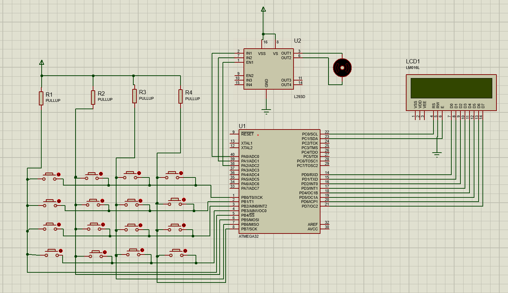

# 🔐 Password Protected Motor Control System Using Keypad and LCD (ATmega32)

This project implements a secure motor control system using an ATmega32 microcontroller, a 4x4 keypad, an LCD, and an L293D motor driver IC.  
The system accepts a 3-digit password from the keypad. If the entered password matches the pre-defined one, it grants access and drives the motor forward. Otherwise, access is denied.

---

## 🟢 Features

- 3-digit password verification
- 4x4 matrix keypad input
- LCD display for instructions and feedback
- Motor controlled through L293D driver
- Simple forward motion on successful authentication

---

## ⚡ Schematic



---

## 💻 Code Overview

```c
#include <avr/io.h>
#include <util/delay.h>

void command(char a);
void data(char a);
void display(const char *p);
char pass;
void forward();
void reverse();
void stop();

int main()
{
    DDRC = 0xFF;  // Control lines for LCD
    DDRB = 0x0F;  // Keypad row lines as output
    DDRD = 0xFF;  // Data lines for LCD
    DDRA = 0xFF;  // Motor control

    // LCD Initialization
    command(0x38);
    command(0x80);
    command(0x01);
    command(0x06);
    command(0x0F);

    display("ENTER PASSWORD:");
    _delay_ms(3000);
    command(0x01);

    char pass[2] = "123";  // Correct password
    char input[2];
    int index = 0;
    int is_correct = 1;

    while(1) {
        // Scan keypad rows
        PORTB = 0x0E; // Row 1 active
        if ((PINB & 0x10) == 0) { input[index++] = '1'; data('1'); while((PINB & 0x10) == 0); }
        if ((PINB & 0x20) == 0) { input[index++] = '2'; data('2'); while((PINB & 0x20) == 0); }
        if ((PINB & 0x40) == 0) { input[index++] = '3'; data('3'); while((PINB & 0x40) == 0); }

        // Other rows (similar logic)...

        if (index == 3) {
            for (int i = 0; i <= 2; i++) {
                if (input[i] != pass[i]) {
                    is_correct = 0;
                    break;
                }
            }

            command(0x01);
            command(0x80);

            if (is_correct) {
                display("GRANTED");
                forward();
                _delay_ms(3000);
                stop();
            } else {
                display("DENIED");
                _delay_ms(2000);
            }

            _delay_ms(2000);
            command(0x01);
            index = 0;
            is_correct = 1;
        }
    }
}

void command(char a) {
    PORTC = 0x02;  // RS=0, EN=1
    PORTD = a;
    _delay_ms(100);
    PORTC = 0x00;  // EN=0
}

void data(char a) {
    PORTC = 0x03;  // RS=1, EN=1
    PORTD = a;
    _delay_ms(100);
    PORTC = 0x01;  // EN=0
}

void display(const char *p) {
    while (*p != 0) {
        data(*p);
        p++;
    }
}

void forward() {
    PORTA = 0x1D;
}

void reverse() {
    PORTA = 0x2E;
}

void stop() {
    PORTA = 0x00;
}

```
## 🛠️ How it works
✅ **Password Check**
- User enters a 3-digit password via the keypad.
- Program stores each digit in `input[]`.
- Once all 3 digits are entered, the system checks against the stored password ("123").

✅ **Access Granted**
- LCD displays "GRANTED".
- Motor moves forward for 3 seconds using `forward()`.
- Then, motor stops.

❌ **Access Denied**
- LCD displays "DENIED".
- Waits before allowing a new attempt.

## 🚀 Steps to run
- Connect your hardware as shown in the schematic (keypad.png).
- Program ATmega32 using the provided code.
- Power up the circuit.
- LCD prompts: "ENTER PASSWORD:"
- Enter the password "123" to grant access.

## 📄 Files
- `main.c` — Complete source code
- `keypad.png` — Circuit schematic
- `README.md` — Project explanation

## 📄 License
This project is shared for educational purposes only. Unauthorized reproduction or commercial use is prohibited.

## ⭐ Credits
Developed for learning and demonstration of keypad-based secure control systems using AVR microcontrollers.

## 💬 Let me know if you'd also like to include simulation files, Proteus files, or separate keypad scanning code explanation!